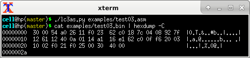
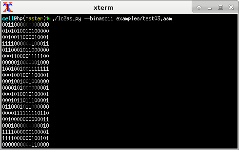
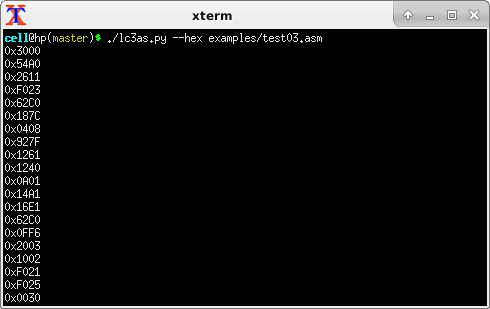
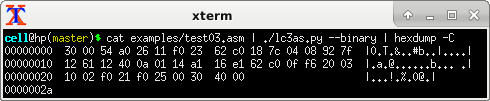
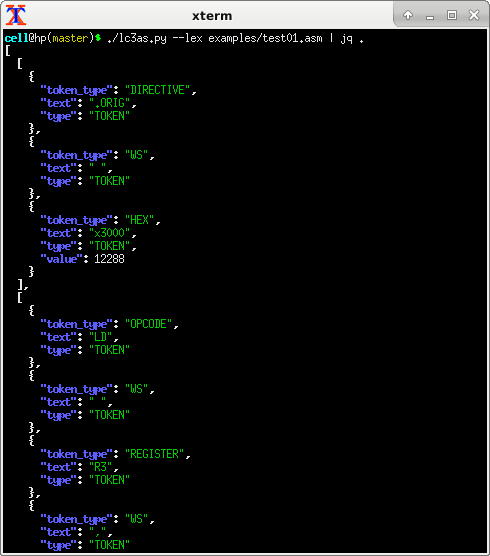
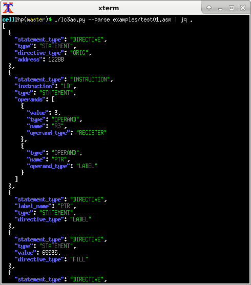
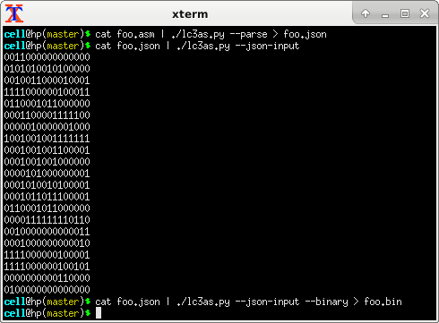
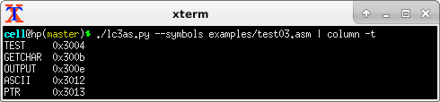
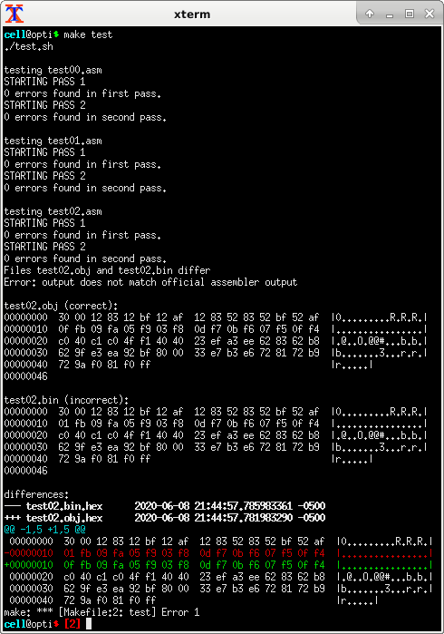

# lc3as.py

An assembler for the [LC-3](https://en.wikipedia.org/wiki/Little_Computer_3) fictitious computer.

The LC-3 is described in the book
_Introduction to Computing Systems: From Bits and Gates to C and Beyond_
([2nd edition](https://www.amazon.com/dp/0072467509))
([3rd edition](https://www.amazon.com/dp/126042474X)).

The ISA,
which consists of only 15 instructions,
is described in [Appendix A](docs/appendix-a.pdf),
which is freely downloadable from the
[publisher's website](https://highered.mheducation.com/sites/0072467509/student_view0/appendices_a__b__c__d____e.html).


## Usage

```
$ ./lc3as.py --help
lc3as.py: an assembler for the LC-3 ficticious machine.

Assemble foo.s (creates foo.bin, binary format):
  lc3as.py foo.s

Assemble standard input into standard output (binascii format):
  cat foo.s | lc3as.py
  cat foo.s | lc3as.py --binascii

Assemble standard input into standard output (hex format):
  cat foo.s | lc3as.py --hex

Assemble standard input into standard output (forced binary format):
Warning: this will spew garbage into your terminal, so redirect the output:
  cat foo.s | lc3as.py --binary > foo.bin
  cat foo.s | lc3as.py --binary | hexdump -C

Stop after lexing foo.s into tokens (JSON output):
  lc3as.py --lex foo.s | jq .

Stop after parsing foo.s into statements (JSON output):
  lc3as.py --parse foo.s | jq .

Stop after generating the symbol table:
  lc3as.py --symbols foo.s | column -t

Assume input has already been parsed (JSON):
(Useful for developing your own custom assembler syntax)
  ./my-custom-frontend foo.s | lc3as.py --json-input --binary > foo.bin
  lc3as.py --parse foo.s | lc3as.py --json-input --binary > foo.bin

Display this help message:
  lc3as.py -h
  lc3as.py --help
```

## Binary output




## Binascii output




## Hex output



Compare to the binary output:




## Lexer output

The lexer's token output can be viewed as JSON:




## Parser output

The parser's output can be viewed as JSON:




## Accepting JSON input

The fact that this assembler accepts JSON as input allows you to leverage `lc3as.py`
as the backend for your own custom assembler frontend!
Create your own custom assembler syntax!




## Symbol table

The assembler can be halted after the 1st pass to view the symbol table:




## Test failure output

If a test fails, `diff` is run to highlight the relevant difference in output:




## Installing the official LC-3 assembler on Linux, macOS

The tests included with this script work
by comparing the output of my assembler to the output of the
[official assembler](http://highered.mheducation.com/sites/0072467509/student_view0/lc-3_simulator.html).

Here is how I installed the official assembler on my Linux computer:

```
mkdir -p ~/dist
wget -O ~/dist/lc3tools-0.12.zip http://highered.mheducation.com/sites/dl/free/0072467509/104652/lc3tools_v12.zip
mkdir -p ~/tmp
cd ~/tmp
unzip ~/dist/lc3tools-0.12.zip
cd lc3tools
./configure
make
mkdir -p ~/opt/lc3tools-0.12/bin
cp -a lc3* ~/opt/lc3tools-0.12/bin/
mkdir -p ~/bin
cd ~/bin
ln -sf ~/opt/lc3tools-0.12/bin/* .
```

This will place symlinks to the LC-3 tools into `~/bin`, which needs to be in your `$PATH`.
